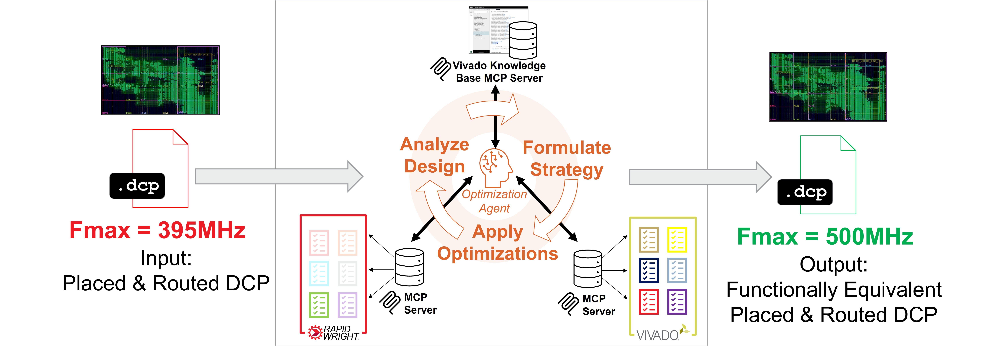

# Contest Details

## Key Details

* The target device for this contest will be the AMD/Xilinx UltraScale+ xcvu3p.
* Competing submissions must consume a fully placed and routed design checkpoint file (.dcp)
* The exact scoring criteria is presented on the [Scoring Criteria](score.html)
  webpage. In general, contestant submissions are expected, in order of importance, to:
    1. Produce a legal, fully placed and routed solution ...
    2. ... that is logically equivalent to the input DCP ...
    3. ... with its maximum clock frequency (Fmax) improved as much as possible
* Contestant submissions will be run on the contest [runtime environment](runtime.html).

## Overview
The contest repo provides a basic agentic tool to optimize placed and routed DCPs. Here are the main highlights of the example agent:

 * Written in Python and designed to use customizable RapidWright and Vivado MCP servers
 * Provides an example to use OpenRouter to provide customizable access to a wide variety of LLMs
 * Provides some basic optimizations that are available in RapidWright (fanout_opt) or Vivado (phys_opt_design)
 * Provies an example system prompt that can be modified and optimized

## Rules
Contestants submit a solution invoked by the conference repo `Makefile` that will read in a DCP and write out a new DCP that has improved Fmax. Here are the rules regarding the output DCP and solution requirements:

  1. Remote LLM access can only occur via the OpenRouter API using the `OPENROUTER_API_KEY` environment variable.  Any other remote LLMs are strictly prohibited.  If submissions are found to be accessing other remote LLM services, the team will be disqualified for the remainder of the contest.
  2. With the exception of OpenRouter access as specified in #1, no communication with any outside entity and/or service is allowed.  
  3. For the output DCP to qualify for Fmax improvement, it must pass the following tests:
     1. The Vivado Tcl command `report_route_status` must report the design as fully routed with 0 routing errors.
     2. The Vivado Tcl command `report_timing_summary` must show that both hold and pulse width requirements are fully met.
     3. The output netlist must be functionally equivalent to the input netlist.  This will be tested through a number of means (more details to come).

## How to Differentiate
There are three main ways to differentiate your team's solution:

1. **New and Customized Optimizations:**  With the advent of open source FPGA CAD tools like RapidWright combined with the power of agentic coding, the barrier to build customized optimizations for FPGA implementations is lower than ever.  The contest repo provides a few example optimizations, one such example splits high fanout nets by replicating source flip flops, placing them in the centroid of their load set and using Vivado to route the modified nets.  Another example identies designs where the placement of cells is too far apart to achieve high frequency and then uses a pblock (area constraint) to re-place the design with the cells forced to be closer in proximity.  Another basic example is the `phys_opt_design` capability provided by Vivado, which can be run multiple times with different options to try a variety of built in optimizations.  We encourage teams to explore new optimization types based on the benchmark suite designs or developing agents that can create customized optimizations on-the-fly! 

2. **Strategic Analysis & Batching:** Building a strategy around design analysis will also help teams improve their overall score by correctly strategizing the quantity, order, and type of optimzations that should be applied to a design.  Being able to dig deeper into the timing report and analyze multiple issues that may not be the first or second order issue will allow the agent to batch optimizations to increase efficiency, since each analysis call requires runtime.

3. **Prompt Engineering & Context management:** Another differentiator for teams will be their approach to prompting the agent and providing adequate context for the designs and optimizations that will be used.  Several efforts in the AI space have found success through prompt optimization (such as [DSPy](https://github.com/stanfordnlp/dspy) and [GEPA](https://github.com/gepa-ai/gepa)) and we encourage teams to explore these techniques.  

## Guidelines for Building Customized Analysis and Optimizations
RapidWright and Vivado have different strengths and weaknesses, but using them properly together can generate signifcant quality-of-result (QoR) improvements.  Here are some basic guidelines to keep in mind when considering customized analysis and optimization tasks in RapidWright, Vivado, or a combination of the two.
 * RapidWright can generally load DCPs 3-5x faster than Vivado
 * RapidWright has a built-in approximate timing model to check timing of a design (see [RapidWright Report Timing Example](https://www.rapidwright.io/docs/ReportTimingExample.html)).  However, its timing model has an error tolerance compared to Vivado of ~2%, and the contest will use Vivado's `report_timing` as the scoring tool. It could provide a quick feedback path (as writing a DCP in RapidWright and then loading it into Vivado will take significantly longer) if exploring multiple optimizations in RapidWright in succession.
 * RapidWright also has a timing-driven router (see [RWRoute Timing Driven Routing](https://www.rapidwright.io/docs/RWRoute_timing_driven_routing.html)), but it is optimized for runtime rather than QoR and it is most likely that Vivado's `route_design` will produce superior timing closure results.  RWRoute also does not have hold-time fixing implemented.
 * Small number of Engineering Change Orders (ECOs)---minor modifications to the netlist or implementation---can be accomplished in a Vivado Tcl script, however, many do not always scale well.  For larger numbers of ECOs, RapidWright can be customized to implement them efficiently.
 * RapidWright has APIs to place cells or to move them around, but does not have a full design placer.  In this case, Vivado's `place_design` is the preferred method for placement.

## FPGA Interchange Format
Optimizations and Analysis do not need to be limited to RapidWright or Vivado.  As RapidWright has the ability to convert DCPs to the [FPGA Interchange Format](https://www.rapidwright.io/docs/FPGA_Interchange_Format.html) (as shown in our [past competition](https://xilinx.github.io/fpga24_routing_contest/)), other open source tools can be used.  

## Scoring Submissions
Please see the [Scoring Criteria](score.html) page for details on how submissions are scored.

