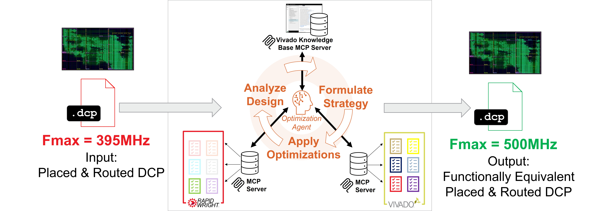

# Agentic FPGA Backend Optimization Competition  @ [FPL'26](https://2026.fpl.org/)

## The Challenge

Given a fully placed and routed design checkpoint (DCP), create a new DCP that improves its maximum clock frequency (Fmax) as much as possible while maintaining logical equivalence and staying fully placed and routed.

## Introduction

Achieving FPGA timing closure can often be challenging and time-consuming. Long place and route compile times, coupled with the frustration of missing timing, often by narrow margins, demands new automated approaches. To address this bottleneck, we present the Agentic FPGA Backend Optimization Competition at FPL 2026. This contest leverages Agentic AI, open-source CAD frameworks ([RapidWright](http://rapidwright.io)), and commercial tools ([AMD Vivado™](https://www.amd.com/en/products/software/adaptive-socs-and-fpgas/vivado.html)) to democratize implementation improvements and timing closure techniques previously only possible by the most experienced engineers.

<video width="100%" controls preload="metadata">
  <source src="assets/ContestPromo3.mp4" type="video/mp4">
  Your browser does not support the video tag.
</video>

Contest participants can utilize Large Language Models (LLMs) and Model Context Protocol (MCP) servers to architect autonomous agents capable of analyzing existing placed-and-routed designs, formulating optimization strategies, and applying ECO-like modifications to iteratively converge onto improved implementation results. 

Teams will differentiate their solutions in three key areas: 
1.	New and Customized Optimizations: Developing specific targeted interventions, such as merging LUTs in critical paths or replicating source cells on high-fanout nets. 
2.	Strategic Analysis & Batching: Creating analysis heuristics that maximize the application of beneficial optimizations within a fixed time budget. 
3.	Prompt Engineering & Context management: Developing techniques to optimize prompt efficacy, efficient problem formulations for LLMs, and mitigate context window limitations.

The competition objective is to create an automated agentic flow that consumes a placed and routed Vivado Design Checkpoint (DCP) and produces a functionally equivalent DCP with improved Fmax. Finalists will be announced at FPL 2026 and awarded cash prizes, with additional incentives provided for teams that open-source their submissions to the community.


To this end, the biggest component of the contest score will be Fmax improvement.


A high-level flow :
[](fpl26-contest-overview-flow.jpg)
More information can be found in [Contest Details](details.html).


## Important Dates (Tentative)

|Date | |
|-----------------|-------|
| 23 February 2026    | Contest Announced |
| ~23 March 2026~<br>**EXTENDED 3 April 2026** | Registration Deadline ([mandatory, see below](#registration))|
| 5 May 2026          | Alpha Submission ([details](alpha_submission.html))|
| 13 July 2026        | Beta Submission ([details](beta_submission.html))|
| 10 August 2026      | Final Submission ([details](final_submission.html))|
| 6-10 September 2026 | Prizes awarded to top 5 teams at [FPL 2026 conference](https://2026.fpl.org/)|

Deadlines refer to Anywhere On Earth.

## Prizes 

Prizes will be awarded to up to 5 finalists:

| Rank | Prize (Euro) |
|------|-------------|
| 1st  | **€3000** |
| 2nd  | **€2000** |
| 3rd  | **€1000** |
| 4th & 5th | **€500** |

Prize amounts subject to change.

***Note 1:*** *50% of the prize money is conditional on the winning entry being made open source under a permissive license (BSD, MIT, Apache) within 30 days of award announcement. This is to encourage participants to help the FPGA community and ecosystem grow faster.*  
***Note 2:*** *Applicable taxes may be assessed on and deducted from award payments, subject to U.S. and/or local government policies.*

## Registration 

Contest registration is mandatory to be eligible for alpha submission and final prizes. To register, please [send an email](mailto:chris.lavin@amd.com) with the following information:
* Subject: `FPL26 Contest Registration`
* Body:
  ```
  Team name: <TEAM NAME>
  Team members and affiliation:
    <NAME> (<AFFILIATION>)
    <NAME> (<AFFILIATION>)
  Advising Professor (if applicable): <NAME> (<AFFILIATION>)
  Single corresponding email: <NAME@AFFILIATION.COM>
  ```

Team size is limited to 6 members (not including advisor(s)).

For development on local hardware, a Vivado license will likely be needed, however, eligible teams from academia can ask their advising professor to apply for a donation of a Vivado license from the AMD University Program.
The advisor can access the donation request form [here](https://www.amd.com/en/corporate/university-program/donation-program.html).
Please ask your advisor to request the number of Vivado licenses you need and add a reference to the FPL contest in the comments section of the donation form.


## Disclaimer

The organizers reserve the rights to revise or modify any aspect of this contest at any time.
